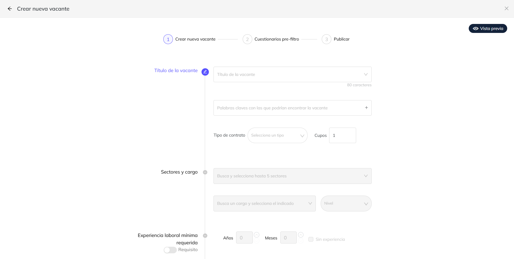
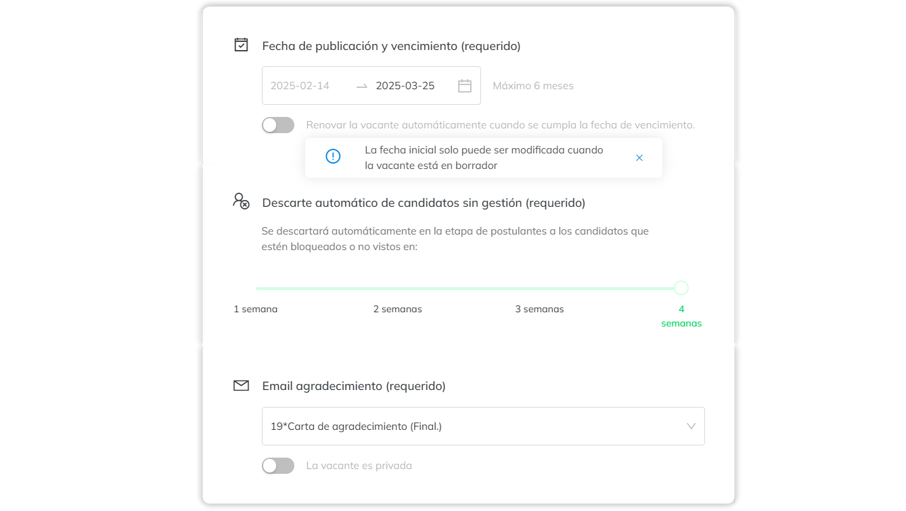
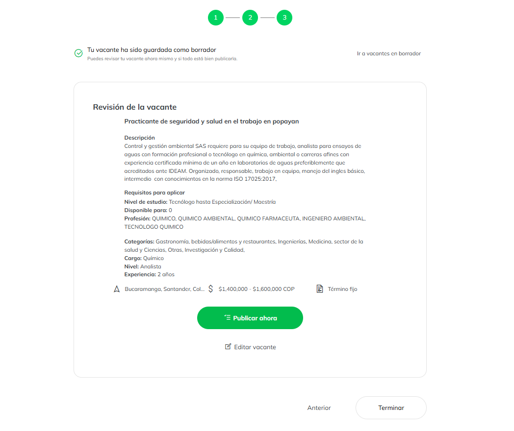

import VideoPlayer from '../../src/components/Video/videoPlayer';

# Crear vacante

<VideoPlayer videoUrl="https://www.youtube.com/embed/2vceKohbRT8" />

## Nueva vacante

Al ingresar a Magneto con tu cuenta, accederás a un tablero de control con un resumen de tus vacantes, accesos directos y tu actividad en el sistema. Para crear una vacante, haz clic en "Nueva vacante".

## Diligenciamiento campos 
El formulario de creación sigue un flujo secuencial:

Campos progresivos: Cada campo se habilita automáticamente al completar el anterior.

Validación automática: Si un campo está deshabilitado, verifica que los anteriores estén correctamente diligenciados antes de reportar un problema.

:::info

**Nota: Si algún campo está deshabilitado, verifica que todos los campos previos hayan sido llenados correctamente antes de reportar un problema.**

:::

## Configuración y vigencia

Fecha de vencimiento: No puede superar los 6 meses.

Descarte automático: Configura la eliminación de candidatos sin gestión en un rango de 1 a 4 semanas

## Previsualización y publicación 

Antes de publicar, podrás revisar una previsualización de la vacante. Una vez confirmados los detalles, haz clic en "Guardar" para finalizar el proceso.

