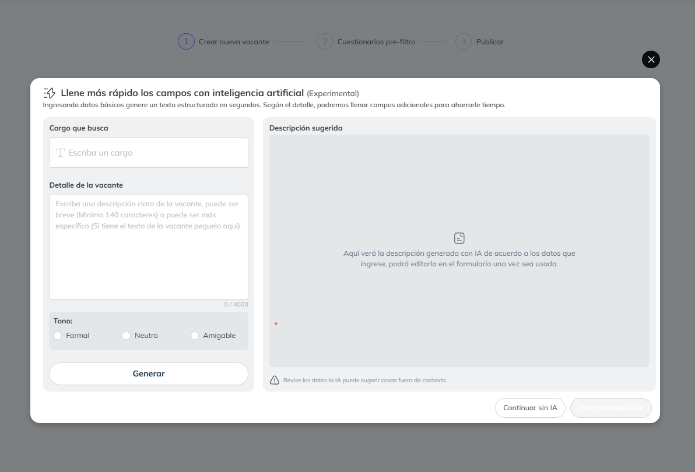

# Creación de vacante con IA

Simplifica la creación de vacantes con inteligencia artificial para acelerar el proceso y mejorar la calidad de las descripciones.

<iframe width="560" height="315" src="https://www.youtube.com/embed/hKhbnRAlJf8" title="YouTube video player" frameborder="0" allow="accelerometer; autoplay; clipboard-write; encrypted-media; gyroscope; picture-in-picture" allowfullscreen></iframe>

## ¿Cómo funciona?

1. **Ingresa el cargo:** Escribe el nombre del puesto que deseas publicar.
2. **Describe la vacante:** Proporciona detalles clave en al menos 140 caracteres para una mayor precisión.
3. **Añade palabras clave:** Incluye términos relevantes para optimizar la búsqueda y adecuación del perfil.
4. **Elige el tono:** Define si la comunicación será formal, neutra o amigable, según la identidad de tu empresa.

