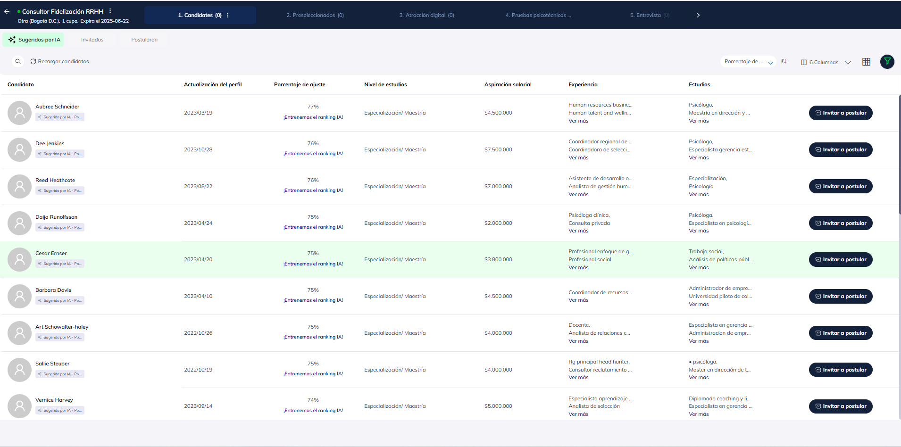
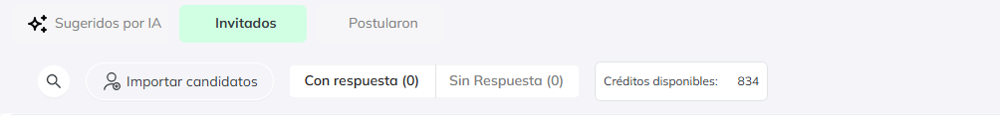
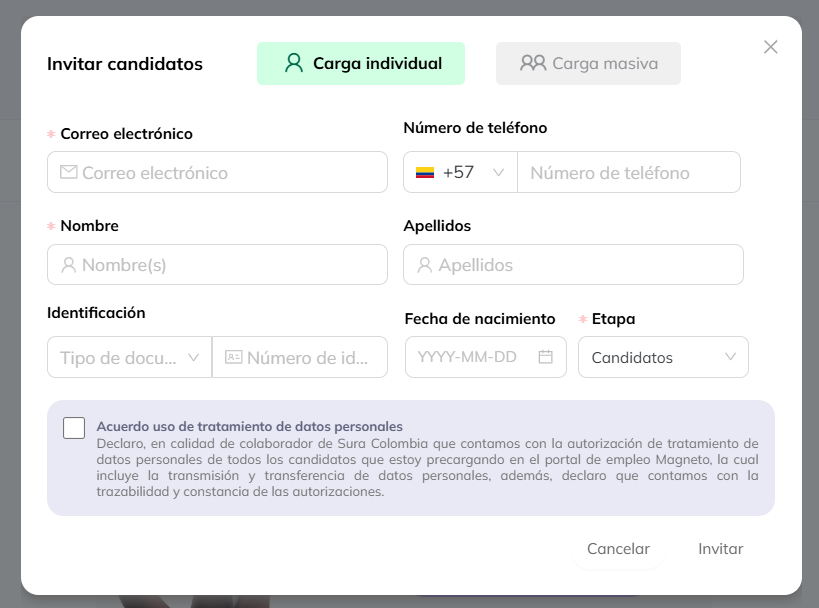

# Invitar candidatos: Importar y Sugeridos IA 

## Invitar desde sugeridos por IA

Al acceder a una vacante verás a los candidatos sugeridos por I.A., seleccionados según su grado de ajuste a la posición publicada . Explora sus perfiles y, si alguno te interesa, invítalo a postularse.**Puedes enviar hasta 20 invitaciones por vacante**

Los candidatos que invites desde **Sugeridos por IA** cambiarán su estado a **Invitados - sin respuesta**. Una vez que respondan y confirmen su interés, pasarán a formar parte del proceso de selección de la vacante y podrás contactarlos.

:::info

**Los candidatos sugeridos por la IA aún no forman parte del proceso de selección. Para que participen, primero debes invitarlos y esperar su aceptación.**

:::

Con esta opción podrás invitar a personas que no estén en el catálogo de candidatos y tienes la opción de hacer una invitación 
masiva de hasta 1.000 personas.

