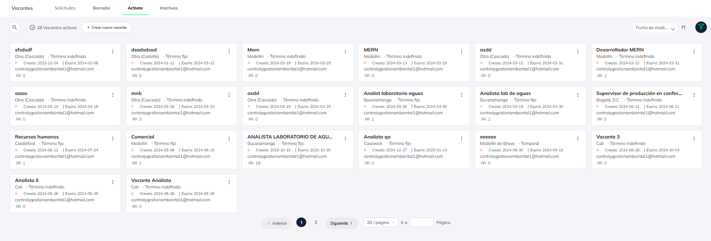
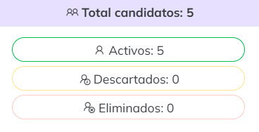
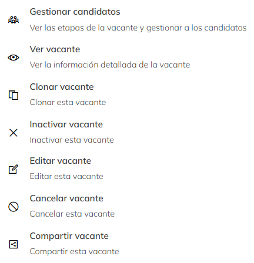

# Estados de la vacante

**En Pymes, las vacantes pueden estar en tres estados:**

**Borrador:** Aún en edición y no han sido publicadas.

**Publicada:** Visible en Magneto y metabuscadores. 

**Inactiva:** Ya no está disponible para los candidatos.

Así verás las vacantes activas en tu cuenta. Te servirá para llevar un control de cuántas personas han postulado, cuál es la fecha de expiración de cada una, la cantidad de candidatos sugeridos por nuestra inteligencia artificial, entre otros datos.

## Tarjeta de vacante

Cada vacante cuenta con una tarjeta informativa, donde podrás ver:

- **Nombre del puesto:** Cargo disponible.
- **Ciudad:** Ubicaciones donde se requiere cubrir la vacante.
- **Tipo de contrato:** Puede ser término indefinido u obra labor.
- **Tiempo de vigencia:** Fecha de inicio y cierre de la vacante. Una vez finalizada, dejará de estar visible en la vitrina de candidatos, pero seguirá disponible para gestión interna.
- **Correo del creador:** Contacto de la persona que publicó la vacante.

Haciendo click en el icono de usuario podrás ver el total de candidatos que siguen activos, descartados o eliminados

## Opciones de las tarjetas de las vacantes 

Cada tarjeta de vacante trae un botón de menú que te desplegará varias opciones, entre esas
hacerla pública, verla nuevamente antes de publicar, clonarla, inactivarla, editarla o 
cancelarla

