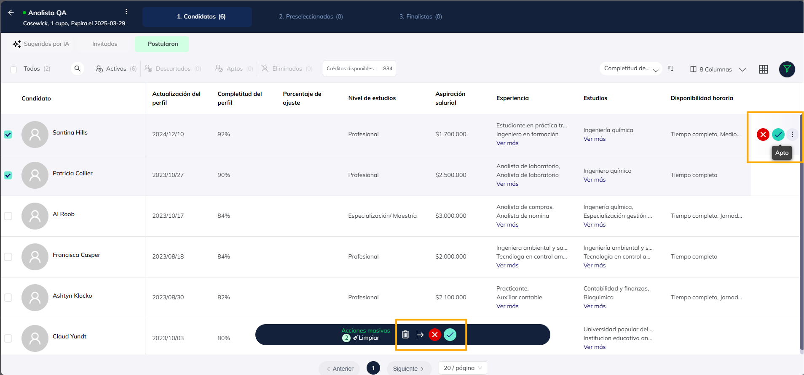

# Gestion de la vacante: Apto y descarte

Al dar clic en cada vacante dentro de tu cuenta, podrás ver los candidatos 
postulados y desde allí mismo podrás descartarlos, dejarlos como aptos para 
la vacante, moverlos a otra etapa (preseleccionado o finalista), copiarlo a otra vacante de tu cuenta o citarlo para hacerle la entrevista.

## Etapas del Proceso

Los candidatos avanzarán por tres fases:

**1. Postulados**

**2. Preseleccionados**

**3. Finalistas → Aquí deberás marcar quién será contratado.**

## Mover candidatos de forma masiva o invidivual

**1. Individualmente:** Usa el botón "Apto" en la parte derecha de cada candidato.

**2. Masiva:** Selecciona varios candidatos con el check box. Esto activará un menú flotante en la parte inferior, donde encontrarás el botón "Apto" para avanzar a todos a la siguiente etapa.

## Opciones de gestión

**1. Apto:** Marca como aptos a los candidatos que superaron la primera etapa.

**2. Descartar:** Filtra y elimina a quienes no cumplen con los requisitos.

**3. Mover de etapa:** Cambia el estado del candidato a Preseleccionado o Finalista.

**4. Copiar a otra vacante:** Si el perfil encaja mejor en otra vacante, puedes duplicarlo.

**5. Agendar:** Agéndales una reunión virtual desde la plataforma.